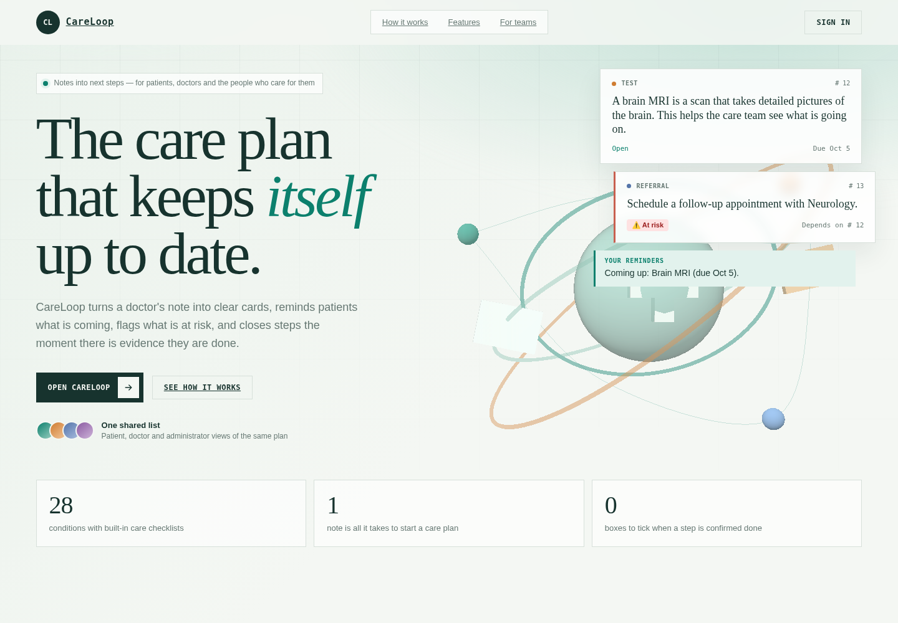
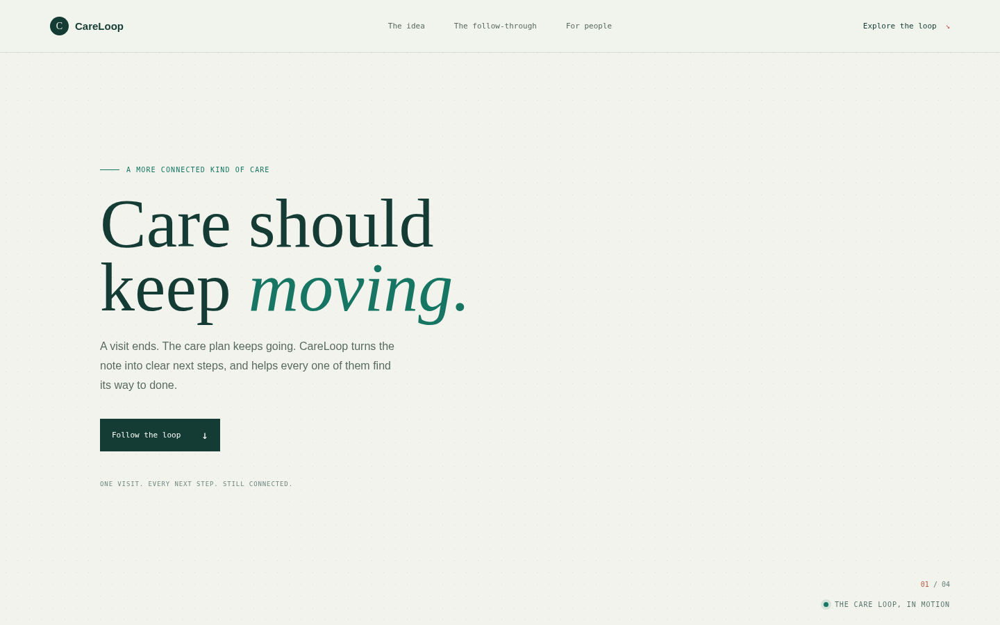
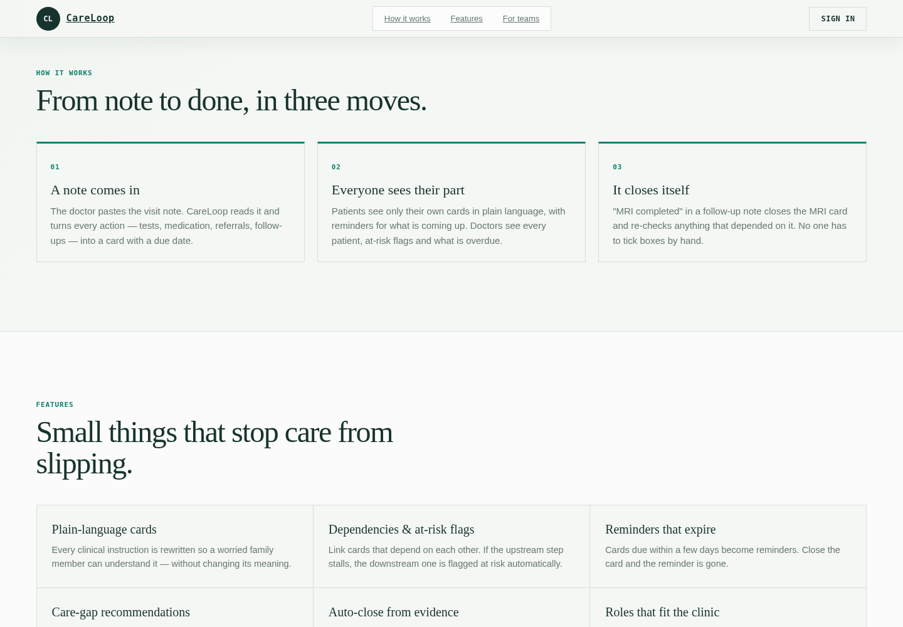
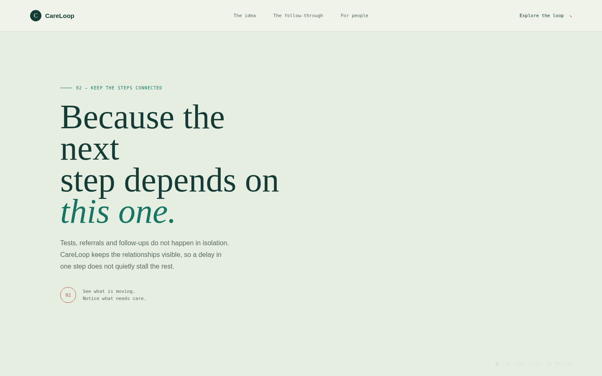
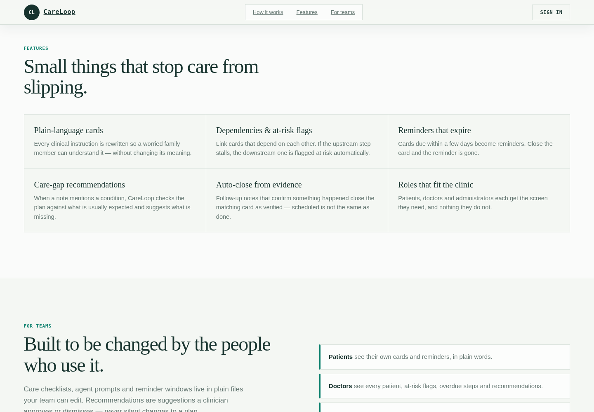
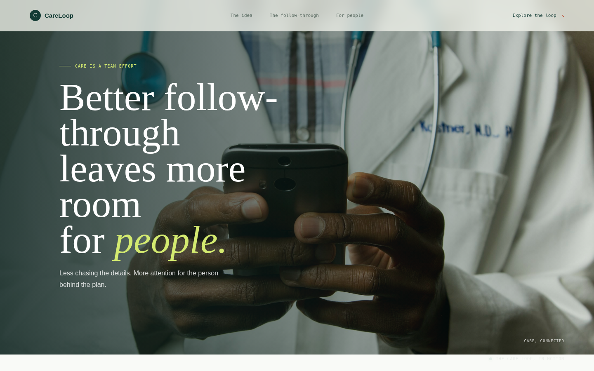
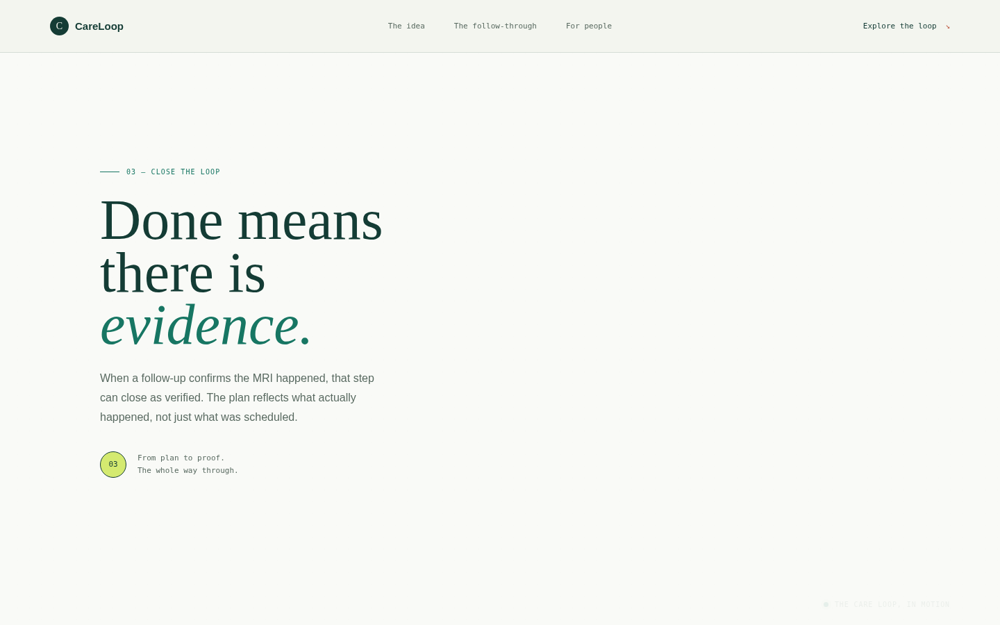
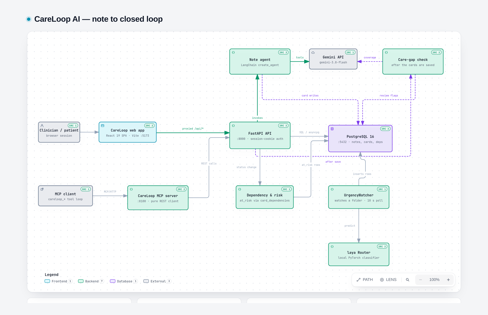

# CareLoop AI

### From a clinical note to care that keeps moving.

CareLoop is a healthcare workflow proof of concept that turns a clinician's visit note into a shared, trackable plan. It helps care teams make follow-up work visible, gives patients clearer next steps, and records when a planned action is supported by evidence that it happened.

	

<em>A separate, scroll-driven promotional experience is available at <a href="https://workatustadarshajay.github.io/CareLoop-AI/promo/">CareLoop: Care that keeps moving</a>.</em>

## The operational challenge

A visit can create several follow-up actions: a test to arrange, a medication to start, a referral to book, and another visit to schedule. Those actions happen after the conversation, across different people and over time. When they live only in prose or memory, it is difficult to see what is due, what is blocked, and what has actually been completed.

CareLoop explores a closed-loop workflow: turn the plan into explicit actions, keep the actions connected, and update their status when follow-up evidence arrives.

## How the workflow works

1. **Capture the plan.** A clinician pastes a visit note into the application.
2. **Structure the next steps.** An AI agent identifies actionable items and saves typed care cards with descriptions and due dates where available.
3. **Coordinate follow-through.** Patients see their own plain-language cards and reminders. Clinicians can review the broader plan, dependencies, overdue work, and at-risk steps.
4. **Close with evidence.** A follow-up note can confirm a completed action and close the matching card as verified. Dependent work is re-evaluated when its blocker changes.

## Business value

CareLoop is designed to make post-visit coordination easier to see and manage. Its value hypothesis is operational, not a claim of measured clinical outcomes:

- **Fewer invisible handoffs:** keep tests, referrals, medications, and follow-ups in one plan rather than scattered across narrative notes.
- **Earlier attention to delays:** surface overdue and at-risk actions, including work that depends on another step.
- **Clearer patient actions:** translate clinical instructions into plain-language cards while retaining the original wording for context.
- **Less manual status chasing:** use follow-up evidence to update completion and re-check dependent actions.
- **More consistent review:** compare a plan with condition-specific care checklists and present missing items as clinician-reviewed recommendations.
- **Role-appropriate visibility:** give patients, clinicians, and administrators different views of the workflow.

These are intended workflow benefits. The repository does not establish that CareLoop improves clinical outcomes, reduces costs, or replaces clinical judgment.

## Who it serves

| User | What CareLoop helps them see or do |
| --- | --- |
| **Patients** | Review their own upcoming and open actions in plain language, with reminders for near-term due dates. |
| **Clinicians** | Review patient plans, overdue work, dependencies, at-risk steps, and proposed care-gap recommendations. |
| **Administrators** | Create patient records and logins without taking on clinical decision-making. |
| **Care teams and builders** | Adapt checklist content, agent prompts, and reminder windows in editable project files. |

## Product visuals

The following images are browser captures of the separate promotional site and the application's public landing page. The authenticated dashboard is not shown; promotional-page imagery explains the concept rather than depicting application screens.

| Promotional experience | Public app landing page |
| --- | --- |
| **The idea**  | **Workflow overview**  |
| **Connected steps**  | **Feature overview**  |
| **Care is a team effort**  | **Evidence closes the loop**  |

The full-page [promotional site capture](docs/images/careloop-promo-home.png) and [application landing capture](docs/images/careloop-app-landing.png) are also available for review.

## System at a glance

The web application is backed by an API and PostgreSQL. The note-processing agent uses Gemini to identify actions and care-gap suggestions. Card dependencies support at-risk status updates. An MCP server exposes API-backed tools for agent clients, while the separate UrgencyWatcher prototype handles files placed in its watch directory.

	

For the detailed component breakdown, see the [architecture notes](docs/architecture-notes.md) or the [interactive architecture diagram](docs/architecture.html).

## Scope and safeguards

CareLoop is a **proof of concept**, not a production clinical system. Notes are entered manually; there is no EHR or FHIR feed. Care-gap items are recommendations for clinician review, not silent changes to a treatment plan. The demo authentication and sample data are not a production identity, privacy, or security model. Do not enter real patient information into a demo deployment.

## Setup

For prerequisites, configuration, database migrations, local services, verification, and troubleshooting, follow [SETUP.md](SETUP.md). This README is the product overview; setup instructions live there.
